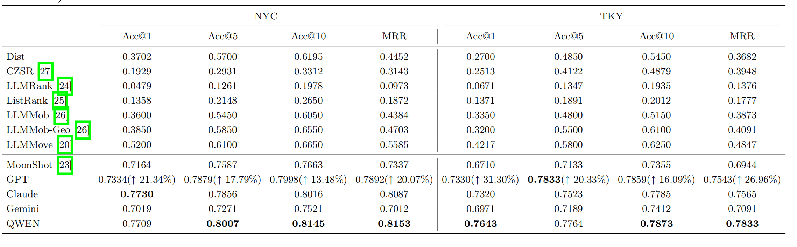

# MAS4POI: A Multi-Agent System for Next Point-of-Interest Recommendation


**MAS4POI** is an innovative multi-agent system (MAS) designed to enhance next Point-of-Interest (POI) recommendation through the collaboration of Large Language Model (LLM)-based agents. Each agent in the system is specialized to handle different aspects of the recommendation process, leveraging the power of LLMs to generate accurate and contextually relevant recommendations. The system has been evaluated on two real-world datasets and integrates six different LLMs to showcase its effectiveness.

## System Architecture

The system is composed of seven specialized agents, each handling different tasks:

- **Manager:** Regulates the workflow, monitors agent activities, and allocates tasks based on the system's status and available resources.
- **Reflector:** Iteratively assesses and refines outputs to improve recommendation quality.
- **DataAgent:** Processes and organizes POI data for accurate embeddings and trajectory visualizations.
- **Navigator:** Handles route planning and generates static maps for effective navigation and landmark recognition.
- **Analyst:** Generates POI recommendations by analyzing user trajectory data and identifying trends in user behavior.
- **UserAgent:** Manages user profiles and interacts with users to gather preferences.
- **Searcher:** Responds to specific user queries by accessing external data sources.

## Features

- **Multi-Agent Collaboration:** Specializes LLMs into distinct roles to handle different stages of POI recommendation, such as data processing, recommendation generation, reflection, navigation, and user interaction.
- **Extensibility:** Supports the integration of various LLMs and external tools, such as Wikipedia and Amap, to extend the system's capabilities beyond POI recommendation, including navigation and real-time Q&A.
- **Cold Start Problem Mitigation:** Collaborating agents ensure robust performance even with limited user data, effectively addressing the cold start issue.
- **Real-World Datasets:** Evaluated on two real-world datasets, providing empirical validation of the system's effectiveness.


## Installation

To get started with MAS4POI, follow these steps:

1. Clone the repository:
   ```bash
   git clone https://github.com/yuqian2003/MAS4POI.git
   cd MAS4POI
   ```
2. Install the required dependencies using setup.py:
    ```bash
    python setup.py install
3. Alternatively, you can install the dependencies using this file:
     ```bash
    pip install -r requirements.txt
4. Once the installation is complete, you can run the system using the following command:
     ```bash
     python main.py
This will execute the main workflow, where you can specify the task (e.g., POI recommendation, navigation, or search) along with other configurations such as the LLM model, dataset, and API keys.                     
                   

## Datasets

The system has been evaluated on two real-world datasets:

- **NYC Dataset:** Contains POI check-in data for New York City.
- **TKY Dataset:** Contains POI check-in data for Tokyo.

Both datasets are structured under the `data/` directory and organized by user activity levels (e.g., very_active, normal, inactive) to analyse cold start issue.


## Main Results
We compare the performance of six LLMs deployed in our MAS4POI across three datasets, as shown below.


## Case Study


## User Cold Start Analysis


## Citation

If you use this code in your research, please cite the following paper:

```bibtex
@article{MAS4POI2024,
  title={MAS4POI: A Multi-Agent System Collaboration for Next POI Recommendation},
  author={Yuqian Wu, Yuhong Peng, Raymond S.T. Lee},
  journal={Journal Name},
  year={2024},
  url={https://github.com/yuqian2003/MAS4POI}
}
```
# Acknowledgments:
This research was supported by *Beijing Normal University-Hong Kong Baptist University United International College (UIC)* and the *IRADs lab*. 
The authors express their gratitude for providing the necessary computational facilities.


